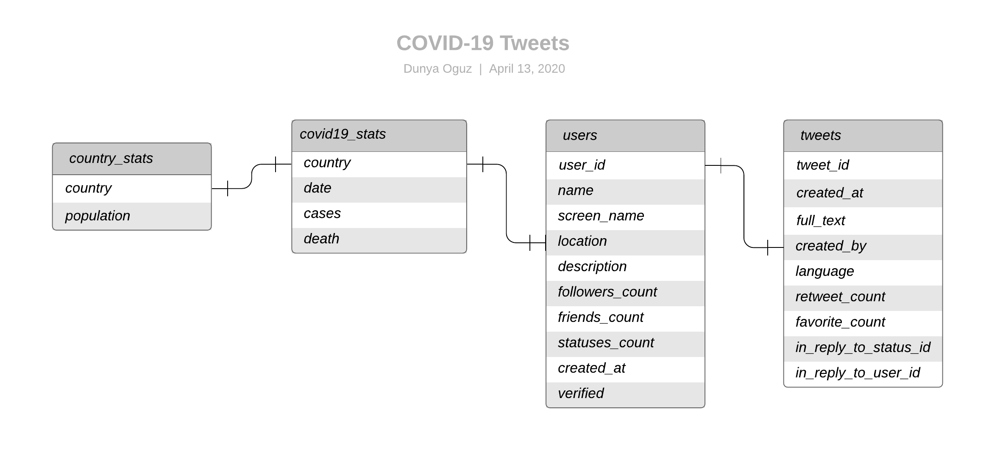
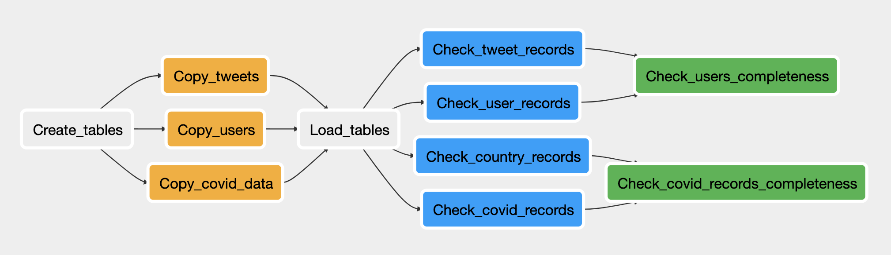

# COVID19 Tweets

## Purpose and Scope

Over the past few weeks, COVID19 has dramatically impacted all realms of public life - from where we go to how we interact with one another - everywhere in the world. In North America, while the growing spread of the novel coronavirus was widely known since the beginning of February, its extreme repercussions begun in the week of March 9th, after the suspension of the NBA season and Trump's ban on European travel on March 12. The crisis came into full force in the following week in Canada and USA, leading to a stock market crash, closure of borders to all foreign nationals, mass lay offs and severe social distancing measures. 

The purpose of this project is to allow analysts to examine public discourse via Twitter regarding COVID19 in a period of 7 days leading up to, including and immediately following March 12 - the point at which the crisis truly and fully erupted in North America - and how it related to the growing number of cases and deaths across the world. Some questions that can be tackled with the data gathered in the project are as follows:

* What was the relationship between number of tweets and number of cases in different countries?
* How did the volume of coronavirus related tweets and interactions with coronavirus related tweets change after March 12 in different countries? 
* Do countries with higher number of cases per capita experience higher number of deaths per capita? 
* What was the relationship between number of users publishing tweets, and the number in deaths and cases across different countries?

## Data Sources

1. Ids of COVID19 related tweets 
    - Source: [Georgia State University](https://zenodo.org/record/3749360#.XpSyuS0ZPfY)
    - Size: 1,636,081 rows
    - Update frequency: Daily 

2. Data on the geographic distribution of COVID-19 cases worldwide
    - Source: [EU Open Data Portal](https://data.europa.eu/euodp/en/data/dataset/covid-19-coronavirus-data/resource/55e8f966-d5c8-438e-85bc-c7a5a26f4863)
    - Size: 10,538 rows
    - Update frequency: Daily 

## Data Model

## ETL Process and Data Pipeline

1. Source data was downloaded locally 
2. Tweet ids were hydrated (i.e. Full details of the tweets were obtained from Twitter API). 
    - Twitter's Terms of Service do not allow the full JSON for datasets of tweets to be distributed to third parties. As such, collections of tweets such as the one used in this project get stored as tweet ids, and it is upon the user of the data to "hydrate" the tweet ids to get their full information.
3. Preprocessing was performed on hydrated tweet data and covid19 data, including de-duplication, null imputation and data type correction. Processed data was uploaded on S3 
4. Redshift cluster was instantiated 
5. Staging, fact and dimension tables were created in Redshift 
6. Processed data was extracted from the S3 bucket and loaded on appropriate tables in Redshift 
7. Data quality checks were performed to ensure that loaded data was complete, accurate and consistent

Steps 5-7 are visualised in the following DAG:

## Directory

* `hydrate.py`: Hydrates each tweet id that exists in the tweets_ids folder
* `redshift_conn.py`: Creates and deletes a redshift cluster programmatically
* `staging_transform.py`: Processes the raw data
* `dags/dag.py`: Collection of all the tasks in the project, organized in a way that reflects their relationships and dependencies
* `dags/create_tables.sql`: SQL code that creates staging, fact and dim tables
* `dags/load_tables.sql`: SQL code that inserts data from staging tables into fact and dim tables
* `plugins/operators/copy_data_from_s3.py`: Custom operator that copies data from S3 to Redshift
* `plugins/operators/check_row_count.py`: Custom operator that checks for the number of rows in fact and dim tables
* `plugins/operators/check_context.py`: Custom operator that runs a given query, and checks if the expected result match the actual result

## Quick Start

1. Download the raw data from the two sources linked above
2. `git clone https://github.com/dunyaoguz/covid19_tweets`
3. `cd covid19_tweets`
4. Obtain a Twitter developer account and get API keys. Create a .env file with your consumer key, consumer secret, twitter access and twitter secret keys
5. Run `python hydrate.py`
6. Create an IAM user on your AWS account with full S3 and Redshift access. Add your AWS secret access key and AWS access key on your .env file
7. Run `python redshift_conn.py`
8. Instantiate Airflow with the `airflow scheduler` and `airflow webserver` commands
9. Create connections on Airflow to your Redshift data warehouse (conn type=postgres) and AWS credentials (conn type=aws)
10. Move the dags and plugins folder to your Airflow home directory
11. Go localhost:8080 on your browser and turn on covid_tweets_dag

## Other Scenarios

Let's address what would have to be done differently in case of some potential scenarios. 

* **The data was increased by 100x:** 
`hydrate.py` and `staging_transform.py` scripts would not be able to be run on a single machine. Distributed computing would need to be utilized in order the hydrate tweets. Data processing would need to be done using Apache Spark, instead of pandas dataframes, on Amazon EMR.

* **The database needed to be accessed by 100+ people:** 
The Redshift cluster used was the cheapest one available. (4 dc2.large type nodes, with 160GB fixed local SSD storage). If the database needed to be accessed by 100+ people, the node type of the cluster would likely need to be changed to a more performant one with better CPU, RAM and storage capacity, and the number of nodes in the cluster would likely need to be increased. 

* **The pipelines would be run on a daily basis by 7am every day:** 
The schedule of the dag would need to be changed in order to ensure completion before 7 AM. 
